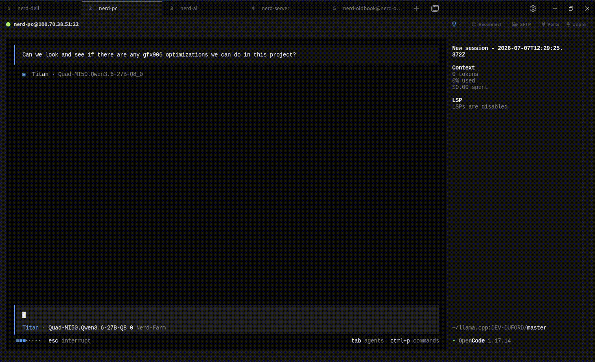

<div align="center">
  <h3>⚡ opencode-titan ⚡</h3>

  


  <p><i>One mind that never touches the keyboard. A fleet of hands that never stops moving.<br>Plan with the slow, expensive genius, and let the fast ones build in parallel.</i></p>

  <p><b>OpenCode Orchestration Plugin</b> · Mix any models · Delegate everything · Run in parallel</p>

  <p><sub>✦ ✦ ✦</sub></p>

</div>

## What's This Plugin

`opencode-titan` is an agent-orchestration plugin for [OpenCode](https://github.com/sst/opencode). It introduces a **Titan orchestrator** — your most capable (and slowest, most expensive) model — whose only job is to think, plan, and route. Every piece of executable work is handed off to a fleet of faster **Myrmidons** that run in parallel.

The core idea is simple: **your smartest model is often your slowest and most expensive one.** Titan is meant to be a frontier heavyweight — something like Opus 5.5, GLM 5.2, or a beast like Nex N2 Pro running on local hardware: far slower and pricier than a typical local model, but far smarter. Instead of letting a model like that grind through file reads, searches, and edits — burning tokens and wall-clock time on grunt work — Titan spends its expensive inference budget only on planning and synthesis, while cheaper, faster Myrmidons do the legwork simultaneously.

The result is a workflow that balances **quality, speed, and cost** — deep reasoning where it matters, raw throughput everywhere else.

To meet the agents, jump to **[Meet the Agents](#meet-the-agents)**. For setup, see **[Getting Started](#getting-started)**.

## How It Works

The plugin builds a two-tier hierarchy of agents:

- **Titan** dispatches all independent tasks to Myrmidons **in parallel** within a single response turn.
- **Myrmidons** share model providers, so Myrmidons running **different models** on the same provider are scheduled sequentially — a provider (physical backend) holds only one model in VRAM at a time. A Myrmidon with `maxInstances > 1` is the exception: multiple instances of its *same* model run in parallel on that provider. The plugin detects provider conflicts and warns Titan so it can plan around them.
- Titan **never** performs work a Myrmidon can handle — it plans, routes, quality-gates, and synthesizes results.

> [!TIP]
> The magic is in the prompt. Titan's system prompt is generated dynamically per session from your configured fleet — it knows each Myrmidon's speed, intelligence, model type, and provider, and delegates accordingly.

## Installation

Add the [`opencode-titan`](https://www.npmjs.com/package/opencode-titan) package to the `plugin` array in your OpenCode config (`opencode.json`). OpenCode installs it automatically from npm on startup:

```json
{
  "$schema": "https://opencode.ai/config.json",
  "plugin": ["opencode-titan"]
}
```

To pin a specific version, append it with `@`:

```json
{
  "$schema": "https://opencode.ai/config.json",
  "plugin": ["opencode-titan@0.1.0"]
}
```

Restart OpenCode and Titan becomes your default agent.

<details>
<summary><b>Alternative: install from source</b></summary>

Use this if you want to hack on the plugin or run an unreleased version.

**1. Clone and build the plugin:**

```bash
git clone https://github.com/DEV-DUFORD/opencode-titan.git
cd opencode-titan
bun install
bun run build
```

This produces the bundled plugin in `dist/`.

**2. Register the local build in your OpenCode config** (`opencode.json`).

OpenCode treats any plugin entry starting with `.`, `file://`, or an absolute path as a local file plugin, so point it at the cloned directory:

```json
{
  "$schema": "https://opencode.ai/config.json",
  "plugin": ["/absolute/path/to/opencode-titan"]
}
```

Restart OpenCode and Titan becomes your default agent.

</details>

## Getting Started

1. **Create your plugin config** at `~/.config/opencode/opencode-titan.jsonc`

2. **Pick your Titan** — the smartest model you have, even if it's slow and expensive (think Opus 5.5, GLM 5.2, or Nex N2 Pro on local hardware).

3. **Assemble your fleet** — one or more Myrmidons, each rated for `speed`, `intelligence`, and `modelType`.

4. **Start OpenCode.** Titan becomes the default agent and delegates from there.

Here's a complete starting configuration:

```jsonc
{
  // Optional: override Titan's model and settings.
  // Titan should be your most capable model, even if it's slow and expensive.
  "titan": {
    "model": "anthropic/claude-sonnet-4-20250514",
    "temperature": 0.1
  },

  // Required: at least one Myrmidon.
  // Myrmidons should be fast and cheap — they do the actual work.
  "myrmidons": [
    {
      "model": "openai/gpt-4.1-mini",
      "speed": 9,
      "intelligence": 6,
      "modelType": "sparse"
    },
    {
      "model": "anthropic/claude-haiku-3.5",
      "speed": 7,
      "intelligence": 8,
      "modelType": "dense"
    }
  ]
}
```

> [!NOTE]
> The legacy `children` key is still accepted as a deprecated alias for `myrmidons` (and each Myrmidon is also routable under its old `child-N` name), so existing configs keep working. New configs should use `myrmidons`. If both keys are present, `myrmidons` wins.

> [!TIP]
> Mix providers to unlock real parallelism. Two Myrmidons running **different models** on the same provider run one after another; two Myrmidons on *different* providers run at the same time. Set `maxInstances` on a Myrmidon to run several copies of its *same* model in parallel on one provider.

> [!TIP]
> Running local models with fixed context windows? Set `maxContextLength` (in tokens) on those Myrmidons. Titan then knows each worker's budget and steers large or complex tasks away from small-context workers — avoiding the lossy mid-task history compaction that would otherwise wreck their output. Leave it off cloud/ample-capacity models.

## Meet the Agents

### 🧠 Titan — The Orchestrator

Titan is the most intelligent agent in the fleet, and by far the slowest and most expensive to run. It never reads a file, runs a search, or writes a line of code if a Myrmidon can do it instead. Its entire purpose is strategic: decompose the goal, route each task to the best-suited Myrmidon, gate the quality of what comes back, and synthesize the final result.

There are two deliberate exceptions where Titan works directly rather than delegating: **context-bound synthesis** (writing up findings, plans, or reports that live in its own accumulated context) and **foundational directive reads** — when you hand Titan a source-of-truth document to execute (a `PLAN.md`, spec, or task list), it reads that document itself, at full fidelity. Delegating the read would only return a lossy summary of the very directive meant to steer Titan's planning and routing.

<table>
  <tr><td><b>Role</b></td><td><code>Planning, routing, quality-gating, and synthesis</code></td></tr>
  <tr><td><b>Prompt</b></td><td><a href="src/agents/titan.ts"><code>titan.ts</code></a> — dynamically built from your fleet</td></tr>
  <tr><td><b>Model Guidance</b></td><td>Choose your strongest reasoning model — an expensive frontier model (Opus 5.5, GLM 5.2) or a heavy local model like Nex N2 Pro. Titan needs judgment and instruction-following, not throughput. Slow and expensive is fine — it delegates the slow, token-hungry parts away.</td></tr>
</table>

### ⚙️ Myrmidons — The Fleet

Myrmidons are the hands. Each executes a delegated task and reports back concisely — responses to Titan are enforced to a single paragraph, 1000 words max by default (configurable via `maxResponseWords`), keeping Titan's context lean. Every Myrmidon declares a `modelType` that shapes how Titan routes work to it:

<table>
  <tr>
    <td width="20%" valign="top"><b>🔍 sparse</b></td>
    <td valign="top">Faster models tuned for <b>information gathering</b> — searching the codebase, reading files, collecting context. Route broad reconnaissance here.</td>
  </tr>
  <tr>
    <td width="20%" valign="top"><b>🛠️ dense</b></td>
    <td valign="top">Models tuned for <b>logic and reasoning</b> — implementation, refactors, and tasks that need careful thought. Route the hard thinking here.</td>
  </tr>
</table>

<table>
  <tr><td><b>Role</b></td><td><code>Execute delegated tasks and report back concisely</code></td></tr>
  <tr><td><b>Prompt</b></td><td><a href="src/agents/myrmidon.ts"><code>myrmidon.ts</code></a></td></tr>
  <tr><td><b>Model Guidance</b></td><td>Choose fast, cost-efficient models. Speed and parallelism usually matter more than raw reasoning power here.</td></tr>
</table>

## Configuration

### Myrmidon Options

| Field | Type | Required | Description |
|---|---|:---:|---|
| `model` | `string` | ✅ | Model identifier in `provider/model` format |
| `speed` | `number` (1–10) | ✅ | Relative speed rating; higher = faster responses |
| `intelligence` | `number` (1–10) | ✅ | Reasoning capability rating; higher = better logic |
| `modelType` | `"dense"` \| `"sparse"` | ✅ | `dense` for logic/reasoning, `sparse` for search/info gathering |
| `enabled` | `boolean` | | When set to `false`, this Myrmidon is excluded entirely — never loaded, never registered, and never shown to Titan. Handy for toggling workers off (e.g. when their backing server isn't running) without deleting their config. Omit to keep the Myrmidon enabled (default). |
| `maxInstances` | `number` (≥1) | | Max parallel instances Titan may run for this Myrmidon. Since instances share the same model (already in the provider's VRAM), they run concurrently on the same provider. Default: `1` |
| `maxContextLength` | `number` (≥1) | | Hard context-window limit (in tokens) for this Myrmidon's model. Mainly for locally hosted models with fixed windows. When set, Titan avoids handing this worker large/complex tasks that would exceed its budget (and force a lossy compaction). Omit for ample-capacity/cloud models. |
| `temperature` | `number` (0–2) | | Sampling temperature (default: `0.1`) |
| `variant` | `string` | | Selects a named model variant defined by the provider for this `model` (see [Model variants](#model-variants)). Must match a variant key the provider declares for the model; leave unset to use the model's defaults |
| `provider` | `string` | | Explicit provider name (defaults to the prefix of `model`) |

### Titan Options

| Field | Type | Description |
|---|---|---|
| `model` | `string` | Titan's model in `provider/model` format |
| `temperature` | `number` (0–2) | Sampling temperature (default: `0.1`) |
| `variant` | `string` | Selects a named model variant defined by the provider for Titan's `model` (see [Model variants](#model-variants)). Must match a variant key the provider declares for the model; leave unset to use the model's defaults |
| `prompt` | `string` | Inline custom system prompt (replaces the default entirely) |

### Plugin Options

| Field | Type | Description |
|---|---|---|
| `titan` | `object` | Titan overrides (see above) |
| `myrmidons` | `array` | The Myrmidon fleet (see above) |
| `children` | `array` | **Deprecated** alias for `myrmidons`, kept for backwards compatibility. Prefer `myrmidons`; if both are set, `myrmidons` wins |
| `disabled_tools` | `string[]` | Tool names to disable for the plugin's agents |
| `maxResponseWords` | `number` (≥1) | Max word count enforced on each Myrmidon's one-paragraph response to Titan (default: `1000`) |
| `backgroundJobs.maxSessionsPerAgent` | `number` (1–10) | Max concurrent sessions per agent (default: `10`) |

### Config Locations

Config is loaded in two layers — **project settings override user settings** via deep merge:

1. **User-level** — searched in `$XDG_CONFIG_HOME/opencode/`, `~/.config/opencode/`, then `~/.opencode/`
2. **Project-level** — `.opencode/opencode-titan.{json,jsonc}`

Both `.json` and `.jsonc` are supported. JSONC files allow comments (`//`, `/* */`) and `{env:VAR_NAME}` environment variable placeholders.

### Model variants

`variant` (available on both Myrmidons and Titan) selects a **named model preset** that the *provider* defines for a given model — it does **not** change which model runs (that's `model`). Think of it as: `model` picks the model, `variant` picks a named configuration of that model.

How it works in OpenCode:

1. **The provider defines variants.** In your OpenCode provider/model config, a model can declare a `variants` map — a set of named presets (e.g. a reasoning/`thinking` mode, a `fast` mode), each with its own overrides.
2. **The agent selects one by name.** Setting `variant: "thinking"` on an agent tells OpenCode to run that model using its `thinking` variant.

Notes:

- The value is **not free-form** — it must match a variant key the provider declares for that specific model. If the model has no matching variant, OpenCode has nothing to resolve it against.
- **Leave `variant` unset** to run the model with its default settings. Most setups don't need it.

### Custom Prompts

Drop prompt files alongside your config to override or extend an agent's system prompt:

| File | Effect |
|---|---|
| `titan.md` | **Replaces** Titan's default system prompt entirely |
| `titan_append.md` | **Appends** to the end of Titan's system prompt |

Search locations:

- **User-level:** `~/.config/opencode/opencode-titan/titan.md`
- **Project-level:** `.opencode/opencode-titan/titan.md`

## Architecture

```
src/
├── index.ts              # Plugin entry — registers agents, hooks, and events
├── agents/
│   ├── index.ts          # Agent factory — creates Titan + N Myrmidons
│   ├── titan.ts          # Titan prompt builder with dynamic Myrmidon descriptions
│   └── myrmidon.ts       # Myrmidon factory with context-budget constraints
├── config/
│   ├── index.ts          # Config exports
│   ├── schema.ts         # Zod schemas for all config types
│   ├── loader.ts         # Config loading — JSONC parsing, env vars, deep merge
│   ├── providers.ts      # Provider resolution helpers
│   └── constants.ts      # Agent names, delegation reminders
└── utils/
    └── provider-lock.ts  # Model-scoped per-provider scheduling lock
```

The plugin registers hooks in `src/index.ts` to wire everything into OpenCode:

| Hook | Purpose |
|------|---------|
| `agent` | Returns the agents record (Titan + Myrmidons) for OpenCode to register |
| `config` | Sets Titan as the default agent and merges plugin agents into the config |
| `chat.message` | Tracks which agent is active per session |
| `experimental.chat.system.transform` | Injects the delegation reminder into Titan's prompt at runtime |
| `event` | Cleans up session state on `session.deleted` |

## Development

```bash
bun run build       # Build to dist/
bun run typecheck   # TypeScript type checking
bun run lint        # Biome linter
bun run format      # Biome formatter
bun run check:ci    # Lint and format (CI mode)
```

Built with TypeScript, bundled to ESM with esbuild, validated with Zod, and linted/formatted with Biome (80-char lines, 2-space indent, single quotes, trailing commas).

## License

MIT
